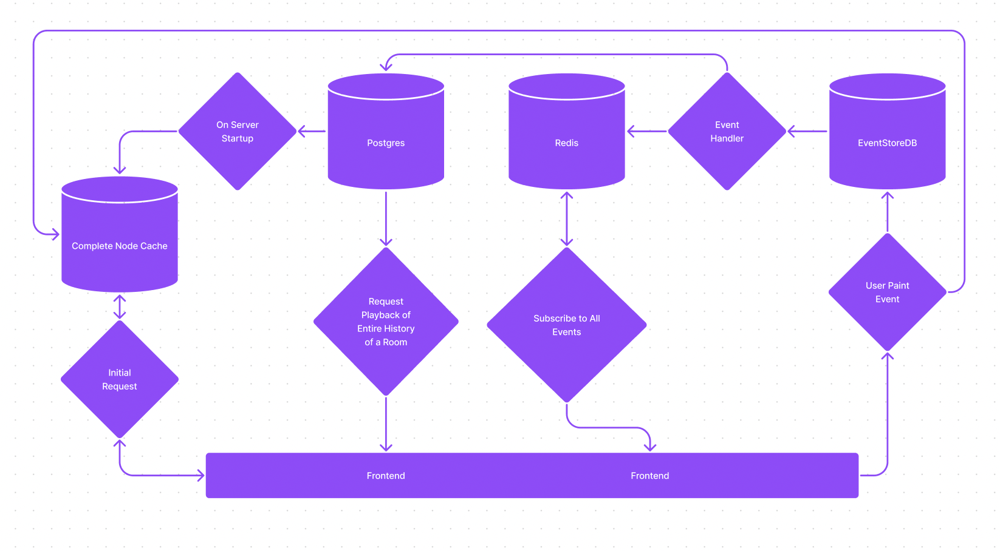

# Setup

1. `npm run fill-it` to install dependencies
2. `npm run sd` to launch app
3. (on initial setup) Switch to the backend and run `npm run migration:run`
    - Note, backend will fail due to tables not existing. Save any file after migrations to fix this.

# Current Architecture

Notes

- Cacheing in Node doesn't actually work with > 1 instances of the server running. 

# What the Architecture Should ACtually Look Like

